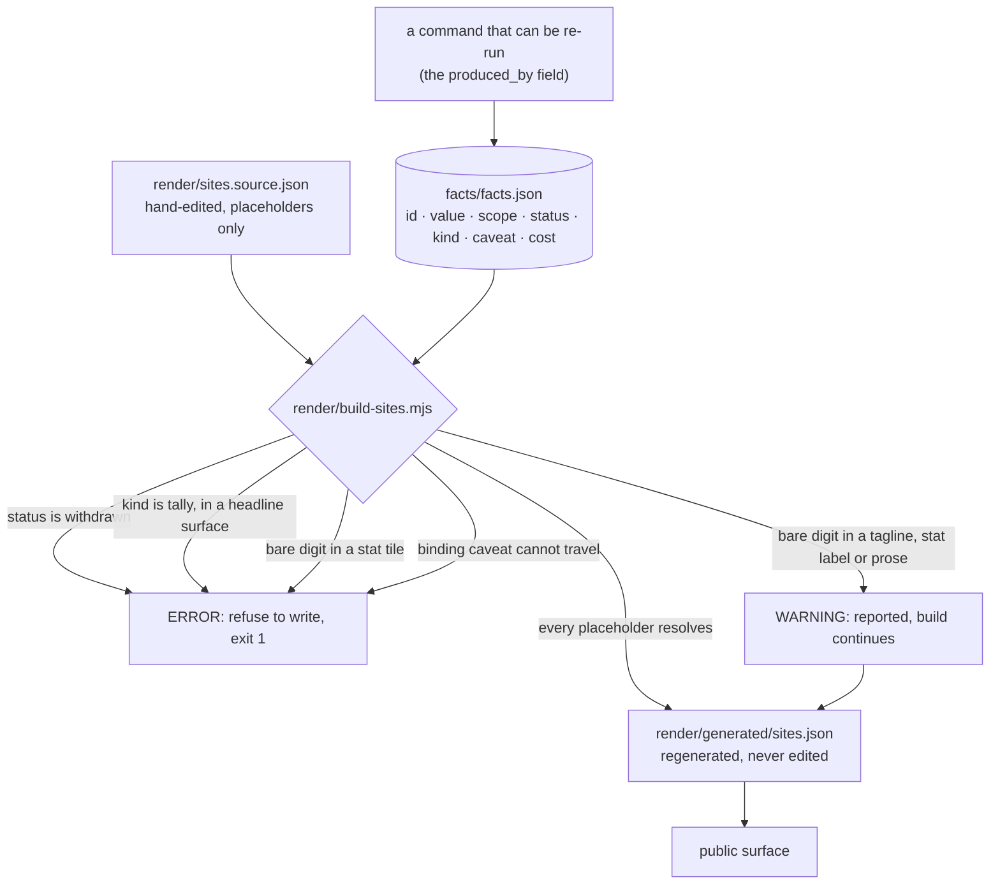
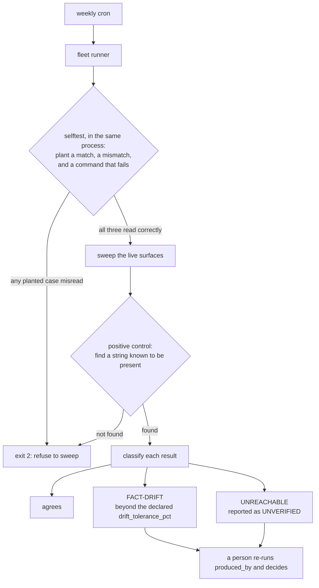
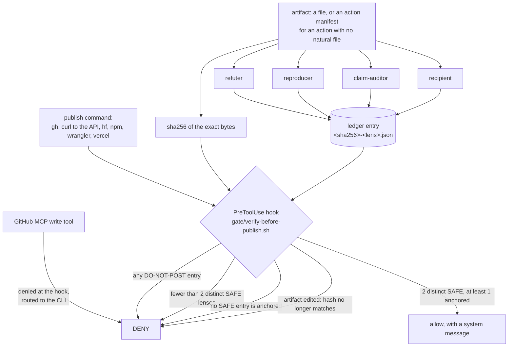

# publishing-estate

A governance system for one person publishing technical claims across many
surfaces. It has two invariants. A number reaches a public surface only through
a registry id, and nothing irreversible ships on one context's judgement. The
mechanisms that enforce them are a fact registry with a render gate, a fleet of
checkers that ask what is true right now, and a set of adversarial lenses whose
verdicts are written to a sha256-bound ledger that a PreToolUse hook reads
before it allows a publish command to run. Every mechanism here was added after
a specific failure, and each one is traceable to a row in
[`docs/incidents.md`](docs/incidents.md).

## Why it exists

Three generations of one generated data file were live at the same time. Every
site rendered its sibling-project cards from a copy of that file, baked in at
deploy time and never regenerated. One site said the flagship runtime ran at
~40 tok/s and was "22% behind WebLLM". The flagship's own copy said 69.6 tok/s
and "+16%". The benchmark artifact said 69.55 and +16.0%. The sign of the
project's founding comparison was inverted on a live page and had been for
weeks.

Nothing in that failure happened at authoring time. Each of the three copies
was correct when it was written. The system was built and battle-tested between
2026-08-14 and 2026-08-17 against that class of defect: a correct thing that
stopped being correct, on a surface nobody owned.

### A note on the numbers in this file

Three kinds of number appear below. A count produced by a command in this
repository is quoted beside that command, and every command in this README was
run against this repository before the README was written. A figure attributed
to published research carries its arXiv identifier and is cited rather than
measured here. A figure from this estate's own record is traceable to a row in
[`docs/incidents.md`](docs/incidents.md). The standing rule is to prefer
deleting a number to updating it, and this file follows it everywhere the
number is not itself the claim being made.

**Requirements.** `node` (developed and tested on v24; plain ESM, no
dependencies), `jq`, `python3` and `shasum` for the gate and its test suite,
`bash`. Four `produced_by` commands in the example registry point at the
author's checkouts and report UNREACHABLE on any other machine — treated as
unverified, never as agreement. A fifth reads a live public endpoint, runs
anywhere with network, and is compared inside its declared drift band.

---

## 1. The fact registry and the render gate

`facts/facts.json` is the single source for every number that appears on any
public surface. `render/build-sites.mjs` is the only path from that registry to
rendered site data. There is no path for a hand-typed number into a stat tile.



### The rules

1. No number appears on any public surface unless it has an id in the registry.
2. `produced_by` must be a command that can be run. If it cannot, the status is
   `unbacked`, and the number may not appear in a headline, tagline or stat
   tile.
3. Status `withdrawn` means the number is retired and must appear nowhere.
4. A ratio must carry its baseline in `scope`. A ratio with no named baseline
   is `unbacked`.
5. Changing a value means re-running `produced_by`. Hand-editing the file is
   not a way to change a value, and no checker in the fleet writes to it.
6. A `caveat` travels with the value to the surface. A `note` is for whoever
   maintains the registry and is never rendered. A `single-run` or
   `provisional` fact must carry a caveat, and the build refuses to render it
   bare.
7. Default to zero numbers. A tally counts something that grows and is stale
   the next commit, so it may appear only on the surface that generates it. A
   measurement is frozen once made, and may be republished only where it is the
   claim the surface exists to make.

### Statuses

| status | meaning |
|---|---|
| `protocol` | reproducible by a recorded command. The only status admitted to a headline surface. |
| `single-run` | a real observation that was not a protocol round. Requires `measured_at`, `measured_on` and a caveat. |
| `provisional` | recorded, qualified, not yet settled. Requires a caveat. |
| `unbacked` | no runnable `produced_by`. Barred from every headline surface. |
| `withdrawn` | retired. Must appear nowhere, in any form. |

`kind: "tally"` is orthogonal to status. A tally is barred from every headline
surface even when its status is `protocol`, because a count that grows is stale
the next commit. That rule exists because a shader-file count was corrected to
a produced, protocol-status value, promoted into a tagline on that basis, and
then moved from 50 to 51 the following day.

### Graded severity

Severity follows the surface a number lands on rather than the rule it breaks.
A stat tile is short, always
redesignable, and read as a claim, so a literal number there is an ERROR. A
tagline mixes metrics with product names, and prose legitimately carries model
specifications, physics scales and citation years, so a literal number in
either is a WARNING that is reported and does not block. The only other public
implementation of an unbacked-number gate was switched off by its own author
for noise. Grading by surface is what keeps this one turned on.

### Running the example

The shipped registry is the author's own, trimmed to the entries that
demonstrate each shape.

```
$ node facts/check-facts.mjs
WARN         kernelfusion.median_apple          unbacked but carries a value (71) - may not appear in a headline, tagline or stat tile until produced_by is runnable

8 facts checked; 1 WARN
6/8 have a runnable produced_by
```

Exit 0. The WARNING is the point of that entry: a ratio published on a live
site whose baseline was never recorded.

```
$ node facts/check-facts.mjs --verify-cheap
...
self-check passed; 4 cheap facts re-run against their produced_by
```

Several `produced_by` commands point at the author's own checkouts and will
report UNREACHABLE elsewhere, which is the correct answer. `example.lens_files`
is repo-local and re-runs green on any clone, so the pass always has something
real to exercise.

The render gate, against the good source:

```
$ node render/build-sites.mjs --check

5 placeholder(s) resolved; 0 literal number(s) still un-traced; 0 error(s)
--check: no output written.
```

Exit 0. `render/sites.source.withdrawn.json` is a planted copy that exists so
the gate can be watched refusing. It plants one error of each class:

```
$ node render/build-sites.mjs --check --source render/sites.source.withdrawn.json
ERROR  SITES.zerotvm.stats[0].value: references WITHDRAWN fact "kernelfusion.apple_avg_2865x" (...)
ERROR  SITES.gpubench.tagline: fact "gpubench.total_runs" is a tally — it may only appear on the surface that generates it, never in a stat tile or tagline
ERROR  SITES.gpubench.stats[0].value: literal number "119 devices" — not traceable to a fact id; use {{fact:id}} or de-number the tile

3 placeholder(s) resolved; 0 literal number(s) still un-traced; 3 error(s)

Refusing to write generated/sites.json.
```

Exit 1, and nothing is written.

The fact id in that first line contains a retracted value. It is reproduced
here as the gate's own refusal of that value and never as a claim, which is the
DISCLOSED-rather-than-LIVE case the withdrawn sweep is built to distinguish.
`docs/incidents.md` records the three other places in this repository where a
withdrawn value legitimately appears.

---

## 2. The checker fleet

The registry and the render gate stop a wrong number from reaching a new
surface. The checker fleet covers surfaces that were published before the fact
changed, and surfaces nothing in the pipeline owns. A build gate protects the
future. A checker asks what is true right now.

The pattern ships here; the checker sources do not. They are bound to one
person's accounts, domains and watched threads, and ported elsewhere they would
be files of someone else's configuration. The useful part is the shape all of
them converged on. [`checkers/README.md`](checkers/README.md) has the full
description and the ten classes.



### The rules

**Selftests run before every sweep, in the same process.** The failure being
defended against is a broken sweep printing a clean sheet on a scheduled run
nobody is watching. `facts/check-facts.mjs` plants three cases through
`runAndCompare()`, the same function the real facts go through: a mismatch that
must read as drift, a match that must read as agreement, and a command that
exits non-zero and must read as unreachable. If any is misread it prints
`SELF-CHECK FAILED` and exits 2 without touching a real fact.

**Every sweep carries a positive control.** A sweep reporting zero findings is
indistinguishable from a sweep that is broken. This estate shipped one: an
unquoted shell variable fed the search tool a bogus path, it errored into
`/dev/null`, and the run reported zero hits for every pattern, including
strings that were definitely present. The rule that came out of it is to treat
any reported verification without a positive control as unverified.

**UNREACHABLE is never a pass.** Offline, an expired token, a moved checkout, a
404 and a rate limit are not evidence that a number is still right. They are a
third outcome and they stay a third outcome. A checker that folds them into
"clean" trains the reader to trust a green run that means nothing. A checker
that folds them into "drift" trains the reader to ignore findings.

**`drift_tolerance_pct` is declared per fact and never global.** A value read
from a live counter moves daily, and a finding that fires every sweep trains
the reader to skip findings. A fact backed by such a counter declares a band.
Within it the published value is a dated snapshot doing its job; beyond it the
snapshot has become misleadingly stale. Exact comparison remains the default.

**Deltas need a seeded baseline.** A watcher reports only what moved since the
last run, and seeds silently on first sight. Two of them need a state file for
a reason worth naming: a concept DOI always resolves to a paper's current
version, so an erratum retiring a figure expires every citing surface with no
visible change anywhere. The only way to see it is to remember what the DOI
resolved to last time.

### Running the example

The selftest and the cheap re-run pass are both in the shipped checker:

```
$ node facts/check-facts.mjs --verify-cheap
```

Sabotage it to watch the selftest work. Change one of the three planted
expectations in `selfCheck()` and re-run: the process prints `SELF-CHECK
FAILED` and exits 2 before reading a real fact.

---

## 3. The lenses, the ledger and the publish gate

A draft that had already survived one authoring pass and four adversarial
review agents still told readers to upgrade to a version that cannot load the
model it recommended. A fifth agent found it by creating a session against the
real build and watching it fail, 34 minutes after the comment was posted.
Everyone subscribed to the thread had already been emailed, and an edit does
not unsend an email.

Two things follow. Verification has to land before the publish rather than
around it. And a verdict that exists only in a transcript has never blocked
anything, so the verdicts are written to a ledger and a hook reads the ledger.



### The rules

**Approval binds to bytes.** A ledger entry records the sha256 of exactly what
the lens read. Editing the artifact changes the hash and revokes every
approval, and the gate distinguishes that case: entries for the same path under
a different hash are reported as stale so the operator learns the file was
edited after verification rather than seeing a bare "no entries found".

**Quorum counts distinct lenses, and at least one SAFE must be anchored.**
Counting agreeing reviewers turned out to measure very little. A SAFE verdict
is absence of evidence from a judge whose measured defect recall is poor, so
the gate additionally requires one verdict whose note cites execution output, a
fetched primary source, or a file and line. Reading-only agreement, however
unanimous, does not clear the gate.

**Any DO-NOT-POST vetoes outright** and cannot be outvoted by any number of
SAFEs. There is no ABSTAIN. A lens that could not verify writes DO-NOT-POST,
because CANNOT-VERIFY is not agreement.

**There is no assertion-only path.** An earlier version allowed a bare
assertion with a warning, which made the ledger optional. The override now
requires both the flag and the artifact path, as environment assignments at the
start of the command. The anchoring matters: an audit found that the literal
string `CLAUDE_PUBLISH_VERIFIED=1`, quoted inside untrusted content a lens was
reviewing, self-authorized the gate.

**The MCP side door is shut.** A GitHub MCP server exposes `create_pull_request`,
`add_issue_comment` and `issue_write` as tool calls that never produce a command
line, so a Bash-only matcher is a gate with an open side door. MCP write tools
are denied at the hook and routed to the CLI, where the ledger flow applies.
They have no override path. Read tools pass through.

**The four lenses have different jobs.** The
[`lenses/`](lenses/) directory holds `refuter` (defaults to "this claim is
wrong" and verifies from primary sources), `reproducer` (establishes truth by
running things and pastes literal output), `claim-auditor` (compares a
description to the artifact it describes, claim by claim) and `recipient`
(reads a draft as each person who will receive the notification). Each is
blinded to authorship and to the other lenses' verdicts. Per-platform posting
rules live in [`lenses/platforms.json`](lenses/platforms.json) with a source
and a date on every rule, because the same rules previously lived as prose
inside one agent definition and at six platforms that becomes six drifting
copies of one checklist.

**Verification depth follows reversibility rather than platform.** `platforms.json`
carries five tiers. `permanent` (DOIs, npm versions, git tags) takes all four
lenses and a human read. `notifies` (GitHub issues, PRs, comments) takes the
refuter and the reproducer. `moderated` (Reddit, HuggingFace) takes the
claim-auditor and the recipient with the platform rules checked explicitly.
`retractable` (X, LinkedIn) takes the claim-auditor. `owned` (own sites and
repos) takes the automated checkers alone. A gate that runs four lenses on
everything gets turned off.

### Running the example

`test/hook-test.sh` is a 32-case adversarial and regression suite, written
fail-first. Its first block is the audit corpus: every string in it was a
working bypass of an earlier version of the gate. It runs against a throwaway
ledger directory and never touches a real one.

```
$ bash test/hook-test.sh
── the audit corpus: every one of these must DENY ──
PASS  quoted flag in body (self-auth hole)                 DENY
...
── ledger flow ──
PASS  2 SAFE but ZERO anchored -> deny                     DENY
PASS  2 SAFE, 1 anchored -> pass                           PASSLED
PASS  DO-NOT-POST vetoes 2 SAFEs                           DENY
PASS  edited file -> stale hash blocks                     DENY
── ledger scale: 600 entries under the timeout ──
600-entry ledger scan wall time: <seconds> (must be well under 10)

RESULT: 32 passed, 0 failed
```

The wall time is the one line above that is a measurement rather than a
verdict, so it is shown as a placeholder. Observed at 0 to 1 second on an
M2 Max, against a bound of 10.

The last block is a regression test for a failure worth stating plainly. The
ledger scan once spawned three processes per entry, and past roughly 580
entries it would have exceeded the hook timeout. A timed-out hook does not
block, so the gate would have silently disabled itself as the ledger grew.

To install the hook, register `gate/verify-before-publish.sh` as a PreToolUse
hook on `Bash` and on the MCP tool namespace. Two environment variables
configure it: `PUBLISH_LEDGER_DIR` (default `$HOME/.claude/verify-ledger`) and
`PUBLISH_REQUIRED_LENSES` (default 2). The entry shape is specified in
[`gate/ledger-entry.schema.json`](gate/ledger-entry.schema.json).

---

## 4. Design decisions, and the evidence behind them

### The withdrawn lifecycle has no counterpart, and graded severity is why it survives

A per-claim status lifecycle — `protocol`, `single-run`, `provisional`,
`unbacked`, `withdrawn` — exists in no tool at any level of adoption. A survey
of the space found three people who independently rebuilt something shaped like
`facts.json` during 2026, all three at zero adoption. The one who also built an
unbacked-number gate disabled it, for noise.

That last data point set the design. A guard that always fires gets bypassed,
and a bypassed guard is worse than none because it leaves the belief that a
guard is running. Grading severity by surface class is what makes this gate
survivable: ERROR in a stat tile, where a number is read as a claim and the
tile can always be redesigned; WARNING in a tagline or prose, where model
specifications, physics scales and citation years legitimately carry digits.
W3C Bitstring Status List 1.0 (Recommendation, 2025-05-15) is a finished
standards hook for status lifecycles that nobody has yet pointed at research
claims.

### SAFE verdicts are not countable evidence

Nine judges drawn from seven model families carry roughly two effective votes
(arXiv 2605.29800). Under production conditions, LLM-judge defect recall was
measured at 22% and then at 0 out of 100 (arXiv 2606.10315). Counting SAFEs
therefore measures family agreement rather than evidence.

The gate's response is the anchored-SAFE requirement. At least one SAFE verdict
must cite something external to the lens's own judgement: literal command
output, a fetched primary source, or a file and line. The `anchored` boolean in
the ledger entry carries it, and the hook denies when the count of anchored
SAFEs is zero regardless of how many plain SAFEs are on record. The asymmetry
in the underlying error costs points the same way: a false positive actively
steers the operator wrong, while a false negative only slows things down
(arXiv 2606.09078).

### Execution beats reading, and the control proves it

The sharpest result here is Stechly et al. (arXiv 2310.12397). Self-critique
made models worse, from 16% to 1%, while an external verifier reached roughly
40%. The control is what matters: with the sound verifier still deciding
correctness, randomized and even fabricated feedback reached the same roughly
40% — the critique content is irrelevant, and the external check carries the
value. Guey and Bougault (arXiv 2606.20093) is the complement: with validity
decided by a deterministic verifier, self-preference is weak or absent — no
detectable effect, with anything under roughly 13 points not excluded at their
sample size.

This is why the `reproducer` lens exists as a distinct role rather than an
instruction inside a general reviewer, why its ledger entries are anchored by
construction, and why the gate requires an anchor at all. It also matches the
estate's own record. Every defect that survived multiple reading passes was
caught by running something.

The reproducer is additionally instructed to be adversarial about its own
harness. Sakana's AI CUDA Engineer reported a 3.13x speedup that collapsed to
1.49x once the evaluation was audited. This estate has a matching scar: a
reported kernel-pool bug was retracted after the harness, rather than the code,
turned out to be wrong. A number obtained from a compromised harness is
CANNOT-VERIFY.

### The guards themselves get fuzzed

This gate had never been adversarially audited. When it was, on 2026-08-16, an
audit agent found eight bypasses in under an hour. The override flag was
matched as a substring of the whole command, so the literal string
`CLAUDE_PUBLISH_VERIFIED=1` quoted inside untrusted content a lens was
reviewing self-authorized the gate. The `/markdown` read-only exemption was
also a whole-command substring, so any publish whose body mentioned it was
exempt. `gh api -f` auto-switches to POST and was unmatched. An assertion with
no artifact was allowed with a warning. The ledger scan would have timed the
hook out past roughly 580 entries, and a timed-out hook does not block.

All eight are regression tests in `test/hook-test.sh` now, and the hardening
changelog is in the header of `gate/verify-before-publish.sh`. The transferable
lesson is the practice rather than any individual fix: run the adversarial
audit on the guards themselves, periodically.

### Tallies and measurements fail differently

A tally counts something that grows — tests, files, runs, devices — and is
stale the next commit. A measurement is frozen once made, given a date, a
machine and a protocol. Treating them as one kind is what produced a shader
count published simultaneously as 18, 27, 42 and 55 — none of them produced by
running anything — beside the one count that was. A tally may appear only on the surface that
generates it. A measurement may be republished, and only where it is the claim
the surface exists to make. Crosslink cards, footers, taglines, nav links and
repo descriptions are decorative surfaces and carry zero numbers. A sentence
without a number cannot go stale.

### The audit trail is arriving as an obligation, and executing it is the moat

The NeurIPS 2026 PPT policy now requires, of flagged submissions appealing
their desk rejection, a pre-AI, post-AI and final version-history audit trail,
and states the expectation directly: "We expect that in future years this kind
of audit trail will become a default." The provenance design here was
not built to the requirement, and satisfies it.

The more useful finding is USENIX's natural experiment. Artifact deposition was
mandated; reproduction stayed flat, and roughly half of deposited artifacts
were never executed by anyone. Registering a `produced_by` command is
deposition. Executing it on a schedule is reproduction, and it is the part that
almost nobody does. That is what `--verify-cheap` on a weekly cron is for, and
it is where the durable value of this design sits.

---

## 5. Limitations

**The command matcher is a denylist, and denylists are fragile.** Shell
obfuscation defeats pattern matching at rates measured between 69% and 99%
(arXiv 2606.15549). Two evasion shapes are matched explicitly (`${IFS}`,
`gh alias set`) and that is a patch rather than a fix. The durable answers are
canonicalization before matching — CARE-style approaches report 85.6% F1 at
2.3ms — and an egress boundary. Neither is implemented here.

**The lenses share a model family.** Four lenses from one family carry roughly
1.7 effective votes — a derived estimate, applying the Kish effective-sample
formula to the error correlations reported in arXiv 2605.29800, not a figure
that paper states. The anchored-SAFE requirement mitigates this and does not
remove it. Evidence-disjoint lens plumbing and a cross-family reproducer are
identified as the next improvements and are not built. Identical evidence
supplied to multiple judges produces herding (arXiv 2607.01661), and roughly
25% of majority verdicts flip under paraphrase of the rubric (arXiv 2606.13685).

**No egress boundary ships in this repository.** The author runs one host-side.
Without it, the gate constrains which commands may run and does not constrain
where data can go. This is the lethal-trifecta leg that a denylist cannot
close.

**This is a single-user design.** Quorum is over lenses rather than people, the
ledger is a local directory with no signing, and there is no multi-operator
story. Signing the ledger was considered and deferred as premature until a
user-presence key exists.

**Audience simulation is advisory and near coin-flip.** The `recipient` lens
splits its output for this reason. Its platform-rules check is scored against
`platforms.json` and carries a verdict. Its simulation of how a named person
will react does not, because simulated audiences run at 52% accuracy overall
and 23% on the hardest constructs, with documented variance collapse (arXiv
2607.03091).

**Lens recall is unmeasured.** There is no seeded-defect fixture corpus, so the
operating point of each lens is unknown. Rubric ablation is known to cost
between 27 and 55 percentage points of recall, against 0.4 points for removing
an entire agent, which suggests the rubrics matter far more than the count of
lenses. Building that corpus is the highest-value open item.

---

## 6. Adopting it

Adopt a mechanism because you recognise its incident in
[`docs/incidents.md`](docs/incidents.md). A rule with no incident behind it is a
guess, and guesses about your own failure modes are usually wrong in the
flattering direction.

### Minimal path

The registry and the render gate. It is useful the day you install it.

1. Copy `facts/facts.json` and `facts/check-facts.mjs`. Empty the `facts` array
   and add one entry for every number currently on any surface you own. Set the
   status honestly. Most will be `unbacked` on the first pass, and that is the
   finding.
2. Copy `render/build-sites.mjs` and adapt `STAT_CONTEXT`, `TAGLINE_CONTEXT`
   and the label and prose pattern beside them to your own source document's
   shape. Replace every literal number in that document with a `{{fact:id}}`
   placeholder.
3. Run `node render/build-sites.mjs --check` in CI or in a pre-commit hook.

### Full path

4. Add the fleet. Build the **withdrawn** and **numbers** checkers first. They
   are the two that check what is live rather than what is in git, and every
   incident that survived longest was live-only. Put `--selftest` and a
   positive control in each before you put either on cron.
5. Add the lenses. Start with `refuter` and `reproducer`; they are the two the
   `notifies` tier requires, which is most of what a technical account
   publishes.
6. Install `gate/verify-before-publish.sh` as a PreToolUse hook and run
   `bash test/hook-test.sh` against your installed copy. Then fuzz it yourself.
   Eight bypasses took under an hour to find the first time this one was
   audited.
7. Write `platforms.json` from your own posting record rather than from what
   the rules pages say. Mark anything you have not checked `unaudited`. An
   invented rule is worse than a recorded gap.

---

## 7. Provenance

This system was built agent-orchestrated with Claude, between 2026-08-14 and
2026-08-17, in the course of publishing real work. Nothing here was designed in
advance. Every mechanism was added after a failure, and
[`docs/incidents.md`](docs/incidents.md) maps each mechanism to the incident
that produced it.

The shape of that table is itself a finding. Read the "what happened" column
and count how many entries describe a correct thing that stopped being correct,
rather than a mistake made at the time of writing. It is most of them.
Publishing systems are usually built to catch errors at authoring time, and
almost nothing here failed at authoring time.

Release of this repository is gated on the system it describes. The published
README carries at least two SAFE ledger entries for its exact sha256, at least
one of them anchored — a verdict whose note cites executed output, a fetched
primary source, or file:line evidence — recorded before the repository became
public. Editing this file after that point revokes those entries, which is the
behaviour the gate exists to have.

## License

MIT. See [LICENSE](LICENSE).
